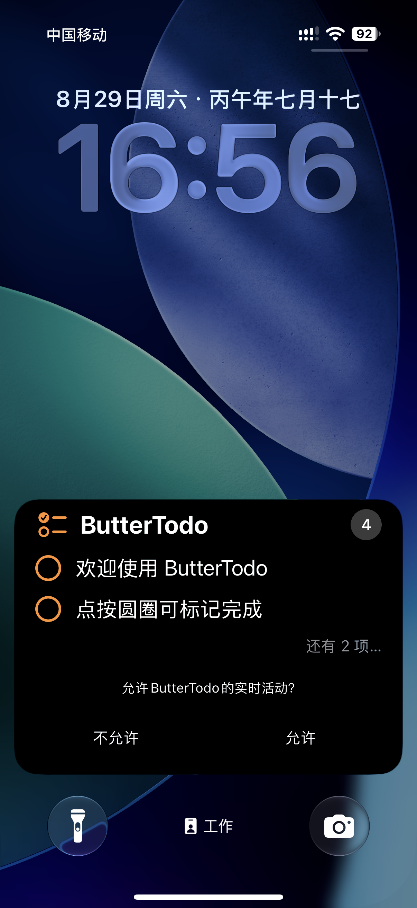
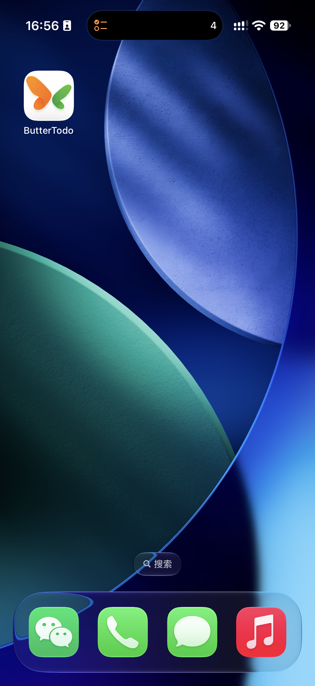
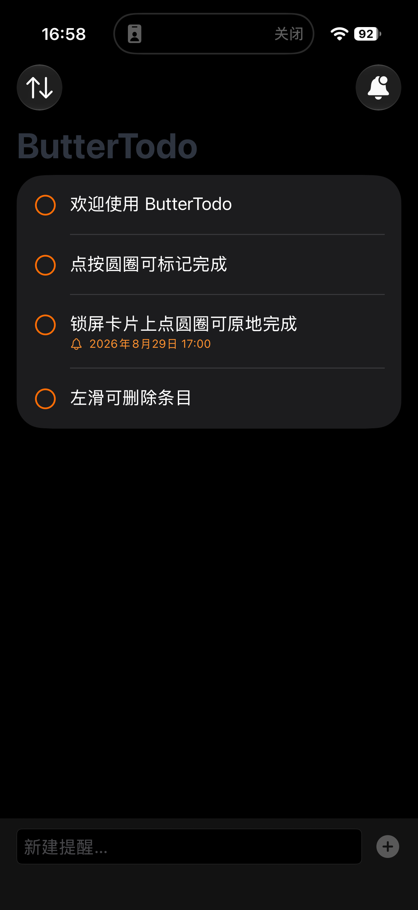
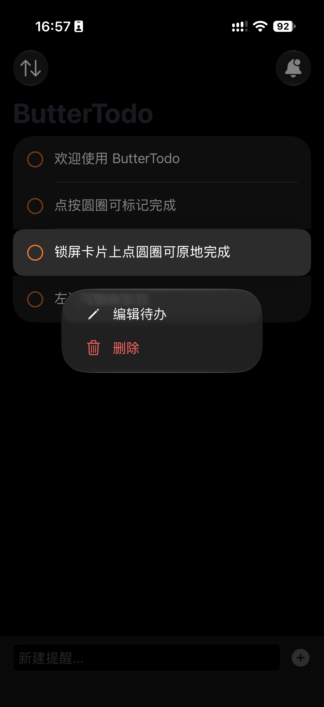
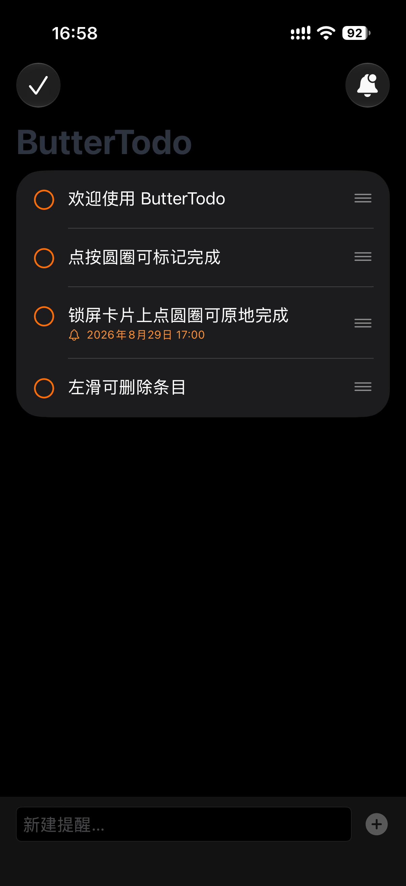
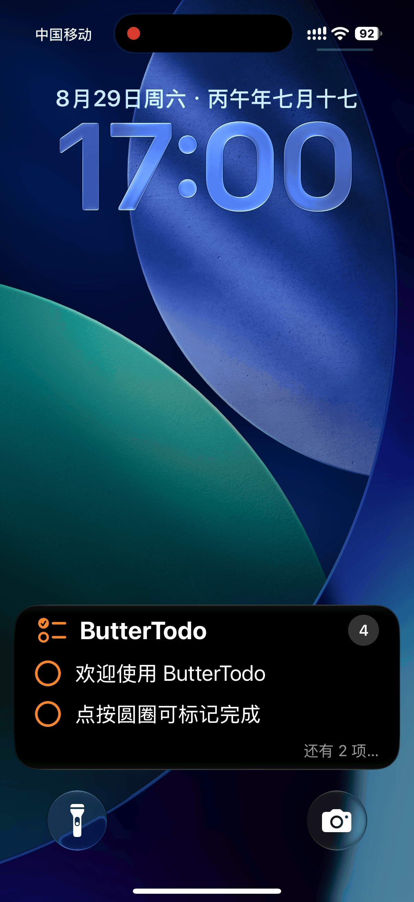

<div align="center">

# 🦋 ButterTodo

**一款把待办「钉」在锁屏上的 iOS 原生待办应用**

锁屏实时横幅 · 灵动岛 · 原地完成 · 到期提醒 · 六语国际化

`iOS 17.2+` · `SwiftUI` · `ActivityKit` · `WidgetKit` · `SQLite`

[](#)
[](#)
[](#)
[](#)

&nbsp;&nbsp;

</div>

---

## ✨ 它解决什么问题

待办应用很多,但大多数要你**主动打开 App 才能想起该做什么**。ButterTodo 把当前待办以 **Live Activity** 形式常驻在锁屏和灵动岛上:

- 抬腕亮屏就能看到还剩几件事、下一件是什么
- **不解锁、不打开 App**,在锁屏卡片上点一下圆圈即可完成
- 全部完成,横幅自动消失,零打扰

## 📸 界面预览

| 锁屏实时横幅 | 主屏 + 灵动岛 |
|---|---|
|  |  |
| *待办常驻锁屏,点击圆圈原地完成* | *蝴蝶图标 + 灵动岛实时徽标* |

| 到期提醒 | 长按编辑/删除 | 拖动排序 |
|---|---|---|
|  |  |  |
| *🔔 到期时间标签* | *长按呼出快捷菜单* | *编辑模式拖动排序* |

> 🎬 编辑模式切换演示(点击 ↑↓ → 右侧 ≡ 手柄直接稳定显示):

<div align="center"></div>

## 🧭 功能总览

### 待办管理
- **新建**:底部输入框,回车或 ➕ 提交,新条目置顶
- **完成**:点圆圈或整行任意位置切换,绿勾 / 橙圈 + 轻触感反馈
- **编辑**:长按 → 「编辑待办」,半屏表单修改标题
- **删除**:右滑 / 长按菜单 / 编辑模式;删除后 5 秒内可**一键撤销**(按原位置恢复)
- **排序**:编辑模式下拖动右侧 ≡ 手柄调整顺序

### 🔒 锁屏实时横幅
- App 启动且有待办时自动挂载,**全部完成自动收起**
- 卡片展示待完成数徽标 + 最多 2 条预览,超出折叠为「还有 N 项…」
- 锁屏圆圈点击由 **App Intent** 在后台进程直接执行,横幅即时刷新
- 右上角铃铛手动开关;手动关闭后自动逻辑不再复活横幅(状态持久化)

### ⏰ 到期提醒
- 编辑待办时打开「提醒我」,设定截止时间,到点弹系统通知
- 行内显示橙色 🔔 + 截止时间标签
- 全自动联动:完成取消提醒、撤销恢复提醒、修改同步更新;App 前台时提醒同样弹横幅

### 💾 数据与同步
- SQLite(WAL 模式)存于 **App Group 共享容器**,主 App 与 Widget 并发读写一致
- 旧版本数据自动迁移;跨进程修改通过 Darwin 通知实时同步界面
- iCloud 多设备同步代码就绪(键值存储 + 最新胜出合并)

### 🌍 国际化
- **联合国六种官方语言**:阿拉伯语、中文、英语、法语、俄语、西班牙语
- 完整复数变格(俄语 / 阿拉伯语)、阿拉伯语自动 **RTL 镜像布局**
- 跟随系统语言,或为 App 单独指定语言

---

## 📱 支持机型

| 支持等级 | 机型 | 横幅形态 |
|---|---|---|
| **完整体验**(灵动岛) | iPhone 17 / 16 / 15 全系、14 Pro / 14 Pro Max | 锁屏卡片 + 灵动岛 |
| **标准支持**(锁屏卡片) | iPhone 14 / 14 Plus、13 / 12 / 11 系列、SE 二代+、XS / XS Max / XR | 锁屏卡片 |

> 系统要求 **iOS 17.2+**;已在 iPhone 17 Pro(iOS 27)真机与 iOS 26.5 模拟器完成全功能实测。

---

## 🚀 快速开始

```bash
git clone https://github.com/xiongchengqing/buttertodo.git
cd buttertodo
open Remindify.xcodeproj
```

1. 用 **Xcode 26+** 打开工程,选择目标设备或模拟器( iOS 17.2+)
2. 配置个人开发团队(Signing & Capabilities → Team)
3. ⌘R 运行

> 工程由 [xcodegen](https://github.com/yonaskolb/XcodeGen) 描述(`project.yml`),改动 target/依赖后执行 `xcodegen generate` 重新生成即可。

**真机体验完整功能**:运行到设备 → 启动 App → 允许「实时活动」与「通知」权限 → 锁屏即可看到横幅。

---

## 🏗 工程结构

```
Remindify/
├── Remindify/                  # 主 App
│   ├── ContentView.swift       # 主界面(列表/编辑模式/撤销/空状态)
│   ├── ReminderStore.swift     # 状态管理与 Live Activity 生命周期
│   ├── KeyboardTapDismiss.swift# 点击空白收起键盘
│   └── Assets.xcassets         # 应用图标(金色蝴蝶)
├── RemindifyWidget/            # Widget 扩展(Live Activity 界面)
├── Shared/                     # 双 target 共享层
│   ├── ReminderModel.swift     # SQLite 数据层 + iCloud KVS 镜像
│   ├── ReminderActivity.swift  # ActivityAttributes 定义
│   ├── ToggleReminderIntent.swift  # 锁屏原地完成 App Intent
│   ├── ReminderNotifications.swift # 到期提醒调度
│   ├── StoreChangeSignal.swift # 跨进程 Darwin 通知
│   └── Localizable.xcstrings   # 六语字符串目录
├── project.yml                 # xcodegen 工程描述
└── docs/                       # 截图与演示视频
```

## 🧱 技术实现要点

- **交互式 Live Activity**:圆圈点击由 `LiveActivityIntent` 在扩展进程执行,不拉起主 App;完成后经 Darwin 通知驱动前台界面同步
- **共享数据层**:SQLite3 直连(WAL + busy_timeout)支撑 App/Widget 并发;跨进程一致性由「存储写入 + Darwin 信号」保证
- **结构稳定的编辑列表**:行的修饰符栈跨模式不变(手势内置短路),规避 iOS 26 List 编辑控件重建丢失的渲染问题
- **本地通知全联动**:完成取消 / 撤销恢复 / 修改重排,前台展示通过 `UNUserNotificationCenterDelegate` 补齐

## 🗺 路线图

- [x] 锁屏实时横幅与原地完成
- [x] 到期提醒通知
- [x] 拖动排序、撤销删除、空状态
- [x] 六语国际化(含复数变格 / RTL)
- [x] SQLite 共享持久层
- [ ] iCloud 多设备同步(代码就绪,待开发者账号启用能力)
- [ ] 主屏小组件(小/中/大尺寸)
- [ ] iPad 与 visionOS 适配

---

<div align="center">

**ButterTodo** · 私有项目,版权所有 © 2026 xiongchengqing

</div>
